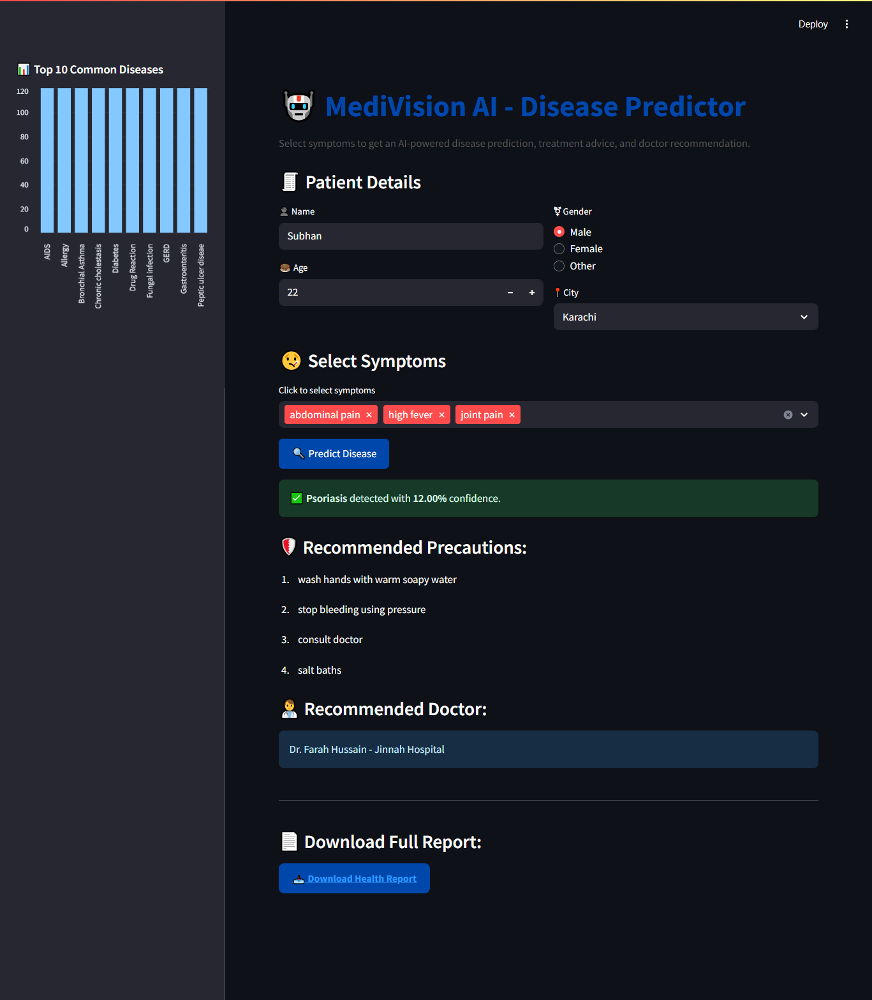

# MediVision AI – Disease Predictor 🧑‍⚕️🤖  

[](https://www.python.org/)  
[](https://streamlit.io/)  
[](LICENSE)  
[](CONTRIBUTING.md)  

---

## 📌 Overview  

MediVision AI is a **machine learning powered disease predictor** that helps in identifying possible health conditions based on patient data.  
The app is built using **Python + Streamlit** and integrates multiple ML models for accurate predictions.  

---

## 🚀 Features  

- 🧑‍⚕️ Predicts diseases based on medical parameters  
- 📊 User-friendly web app interface (Streamlit)  
- 🔒 Lightweight & secure – runs locally or on cloud  
- 📷 App Preview:  

  

---

## 🛠️ Tech Stack  

- **Language:** Python 3.9+  
- **Framework:** Streamlit  
- **Libraries:** scikit-learn, pandas, numpy, matplotlib, seaborn  

---

## ⚡ Installation  

Clone the repo and create a virtual environment:  

```bash
git clone https://github.com/your-username/MediVision-AI-Disease-Predictor.git
cd MediVision-AI-Disease-Predictor

# Create virtual environment
python -m venv venv

# Activate it
# On Windows:
venv\Scripts\activate
# On Linux/Mac:
source venv/bin/activate

# Install dependencies
pip install -r requirements.txt

▶️ Usage
streamlit run app.py


Open the given localhost URL in your browser.

## 📂 Project Structure

```bash
MediVision-AI-Disease-Predictor/
├── app.py
├── requirements.txt
├── README.md
├── screenshots/
│   └── app.png
├── models/
├── data/
└── venv/


🤝 Contributing

Pull requests are welcome! For major changes, please open an issue first to discuss what you would like to change.

📜 License

This project is licensed under the MIT License.